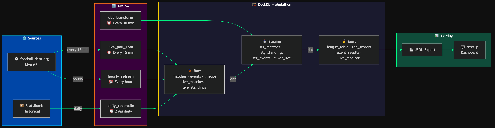

# ⚽ EPL Pipeline — End-to-End Data Engineering Portfolio

A production-grade data pipeline that ingests English Premier League data, transforms it through a medallion architecture in BigQuery, and serves it via a live FotMob-style web dashboard.



## 🏗️ Architecture

```
┌─────────────────┐     ┌──────────────┐     ┌──────────────┐     ┌──────────────┐
│  Data Sources    │────▶│   Airflow     │────▶│   BigQuery    │────▶│  Next.js App │
│                  │     │  (Docker)     │     │  (Medallion)  │     │  (Dashboard) │
│ • football-data  │     │              │     │              │     │              │
│ • API-Football   │     │  Extract      │     │ Raw → Staging │     │ Live Scores  │
│ • StatsBomb Open │     │  Load         │     │ → Mart (dbt)  │     │ Standings    │
└─────────────────┘     └──────────────┘     └──────────────┘     │ Player Stats │
                                                                    │ Match Detail │
                                                                    └──────────────┘
```

### Data Flow (Medallion Architecture)

| Layer | BigQuery Dataset | Description |
|-------|-----------------|-------------|
| **Bronze (Raw)** | `epl_raw` | Raw JSON responses, append-only, partitioned by ingestion date |
| **Silver (Staging)** | `epl_staging` | Cleaned, deduplicated, typed. dbt models with tests |
| **Gold (Mart)** | `epl_mart` | Business-ready: standings, player stats, match summaries |

### Data Sources

| Source | Data | Frequency | Free Tier |
|--------|------|-----------|-----------|
| [football-data.org](https://www.football-data.org/) | Fixtures, scores, standings | Every 5 min (matchday) / hourly | 10 req/min |
| [API-Football](https://www.api-football.com/) | Events, lineups, player stats | Every 5 min (matchday) / daily | 100 req/day |
| [StatsBomb Open Data](https://github.com/statsbomb/open-data) | Historical match events | On-demand backfill | Unlimited |

## 🚀 Quick Start

### Prerequisites
- Docker & Docker Compose
- GCP account with BigQuery enabled
- API keys for football-data.org and API-Football (free tiers)

### 1. Clone & Configure
```bash
git clone https://github.com/StarLord598/epl-pipeline.git
cd epl-pipeline
cp .env.example .env
# Add your API keys and GCP project ID to .env
```

### 2. Start Airflow
```bash
docker compose up -d
# Airflow UI: http://localhost:8080 (admin/admin)
```

### 3. Start Dashboard
```bash
cd dashboard
npm install && npm run dev
# Dashboard: http://localhost:3000
```

## 📁 Project Structure

```
epl-pipeline/
├── airflow/
│   ├── dags/                    # Airflow DAG definitions
│   │   ├── ingest_fixtures.py   # Fixtures & scores ingestion
│   │   ├── ingest_standings.py  # League table ingestion
│   │   ├── ingest_player_stats.py # Player statistics
│   │   ├── ingest_match_events.py # Match events & lineups
│   │   ├── backfill_statsbomb.py  # Historical data backfill
│   │   └── dbt_transform.py     # Trigger dbt runs
│   ├── plugins/                 # Custom operators & hooks
│   ├── include/sql/             # SQL templates
│   └── tests/                   # DAG unit tests
├── dbt/                         # dbt project (transforms)
│   ├── models/
│   │   ├── staging/             # Silver layer
│   │   └── mart/                # Gold layer
│   ├── tests/                   # Data quality tests
│   └── dbt_project.yml
├── dashboard/                   # Next.js web app
│   ├── src/
│   │   ├── app/                 # App router pages
│   │   ├── components/          # React components
│   │   └── lib/                 # BigQuery client, utils
│   └── package.json
├── infra/
│   ├── terraform/               # GCP resource provisioning
│   └── docker/                  # Custom Dockerfiles
├── scripts/                     # Utility scripts
├── docs/                        # Architecture diagrams
├── docker-compose.yml           # Airflow + services
├── .github/workflows/           # CI/CD
└── .env.example                 # Environment template
```

## 📊 Dashboard Features

- **Live Scores** — Current/recent matchday results
- **League Table** — Full EPL standings with form guide
- **Top Scorers** — Golden Boot race with per-game stats
- **Match Detail** — Events timeline, lineups, key stats
- **Player Profiles** — Season stats, performance trends

## 🛠️ Tech Stack

| Component | Technology |
|-----------|-----------|
| Orchestration | Apache Airflow 2.9 (Docker) |
| Warehouse | Google BigQuery |
| Transforms | dbt-core + dbt-bigquery |
| Dashboard | Next.js 14 + Tailwind CSS + shadcn/ui |
| Infra | Terraform, Docker Compose |
| CI/CD | GitHub Actions |
| Language | Python 3.11, TypeScript, SQL |

## 📝 License

MIT
