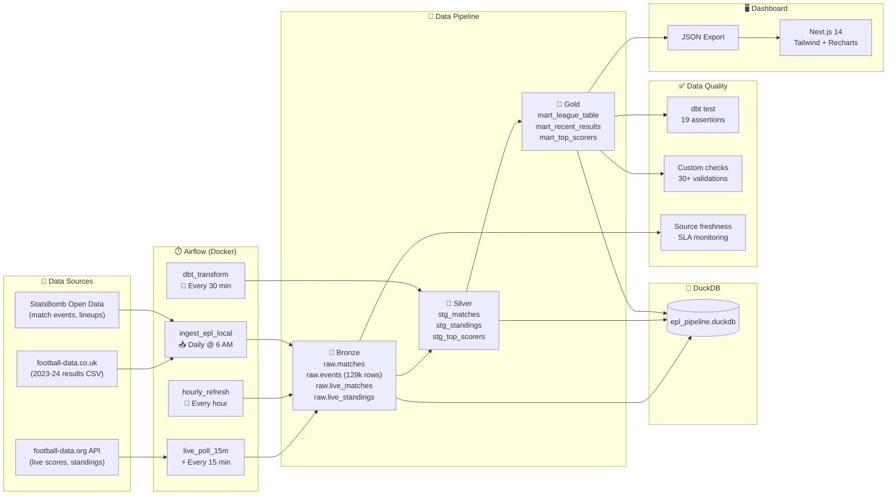

# ⚽ EPL Analytics Pipeline

> **A production-grade data engineering pipeline** that ingests, transforms, tests, and visualizes Premier League data — orchestrated by Airflow, modeled in dbt, stored in DuckDB, and served through a Next.js dashboard.

[](https://github.com/StarLord598/epl-pipeline/actions)

---

## 🏗️ Architecture



## ✨ Features

| Feature | Details |
|---------|---------|
| **Live Data Ingestion** | football-data.org API pulls live scores + standings every 15 minutes |
| **Historical Data** | 380 matches (2023-24) + 129k StatsBomb events (Arsenal 03/04) |
| **Medallion Architecture** | Bronze → Silver → Gold with clear data contracts |
| **dbt Transforms** | 6 models (3 staging views + 3 mart tables), 19 test assertions |
| **Incremental Models** | `mart_recent_results` uses incremental materialization |
| **Data Quality Framework** | 30+ checks: schema, row counts, uniqueness, business rules, freshness |
| **Source Freshness** | dbt source freshness with warn/error SLAs |
| **Airflow Orchestration** | 4 DAGs in Docker Compose (LocalExecutor + Postgres) |
| **Live Dashboard** | Next.js 14 with real-time match tracking, auto-refresh every 60s |
| **CI/CD** | GitHub Actions: lint → integration test → dbt → data quality → Docker build |
| **Portable SQL** | Custom `safe_divide` macro for BigQuery ↔ DuckDB portability |

## 🚀 Quick Start

### One-command setup
```bash
make setup    # Install Python + Node dependencies
make run      # Ingest → Transform → Export (full pipeline)
make test     # Run dbt tests + data quality checks
```

### Or step by step
```bash
# 1. Setup
python3 -m venv venv313 && source venv313/bin/activate
pip install -r requirements.txt
cd dashboard && npm install && cd ..

# 2. Ingest
python scripts/ingest_full_season.py    # 2023-24 season (380 matches)
python scripts/ingest_data.py           # StatsBomb events (129k rows)

# 3. Transform
cd dbt && dbt run --profiles-dir . && dbt test --profiles-dir .

# 4. Export + View
python scripts/export_json.py
cd dashboard && npm run dev             # → http://localhost:3000
```

### Airflow (Docker)
```bash
make airflow-up     # Build + start Airflow containers
                    # → http://localhost:8080 (admin/admin)
make airflow-down   # Stop everything
```

## 📊 Dashboard Pages

| Page | Description |
|------|-------------|
| **🏆 League Table** | Full standings with qualification zones, form, per-game stats |
| **⚡ Live Matches** | Real-time scores with auto-refresh, status badges (LIVE/HT/FT) |
| **⚽ Results** | All 380 matches browseable by gameweek |
| **🎯 Top Scorers** | Golden Boot race with bar charts |
| **📊 Stats** | Radar charts, team comparisons (select up to 4 teams) |
| **🏟️ Team Pages** | Per-club season summary with match history |
| **🩺 Health** | Pipeline health status |

## 🗂️ Project Structure

```
epl-pipeline/
├── Makefile                    # One-command interface
├── docker-compose.yml          # Airflow + Postgres
├── requirements.txt            # Python dependencies
├── .github/workflows/ci.yml    # 4-stage CI pipeline
│
├── scripts/                    # Python ingestion + exports
│   ├── ingest_data.py          # StatsBomb event ingestion
│   ├── ingest_full_season.py   # football-data.co.uk (2023-24)
│   ├── ingest_live_matches.py  # Live API → DuckDB
│   ├── ingest_live_standings.py
│   ├── export_json.py          # DuckDB mart → dashboard JSON
│   ├── export_live_json.py     # Live data → dashboard JSON
│   ├── data_quality_checks.py  # 30+ quality assertions
│   └── live_common.py          # Shared utilities
│
├── dbt/                        # SQL transformations
│   ├── models/staging/         # Silver layer (views)
│   │   ├── stg_matches.sql
│   │   ├── stg_standings.sql
│   │   └── stg_top_scorers.sql
│   ├── models/mart/            # Gold layer (tables)
│   │   ├── mart_league_table.sql
│   │   ├── mart_recent_results.sql  # ← incremental
│   │   └── mart_top_scorers.sql
│   ├── macros/
│   │   ├── safe_divide.sql     # BigQuery ↔ DuckDB portable
│   │   └── generate_schema_name.sql
│   └── profiles.yml            # Multi-target (local/prod/dev)
│
├── airflow/dags/               # Orchestration
│   ├── ingest_epl_local.py     # Daily full pipeline
│   ├── hourly_refresh.py       # Hourly live refresh
│   ├── live_poll_15m.py        # 15-min live scores
│   ├── dbt_transform.py        # 30-min dbt runs
│   └── ...                     # Additional DAGs
│
├── dashboard/                  # Next.js 14 + TypeScript
│   ├── app/                    # Pages (App Router)
│   │   ├── page.tsx            # League table
│   │   ├── live/page.tsx       # ⚡ Live matches
│   │   ├── results/page.tsx    # Match results
│   │   ├── scorers/page.tsx    # Top scorers
│   │   └── stats/page.tsx      # Team comparisons
│   ├── components/             # Reusable UI
│   └── lib/data.ts             # Types + team colors
│
├── data/
│   └── epl_pipeline.duckdb     # Local OLAP database
│
└── infra/docker/
    └── Dockerfile.airflow      # Custom Airflow image
```

## 🧪 Testing & Quality

### dbt Tests (19 assertions)
```
✅ unique + not_null on all primary keys
✅ Source freshness SLAs (warn: 24h, error: 72h)
✅ Schema tests on staging + mart models
```

### Data Quality Framework (`scripts/data_quality_checks.py`)
| Category | Checks | Examples |
|----------|--------|---------|
| **Schema** | 10 | All expected tables exist with data |
| **Row Counts** | 5 | matches ≥ 300, events ≥ 50k, teams = 20 |
| **Uniqueness** | 4 | No duplicate match_ids, team_ids, player_ids |
| **Completeness** | 7 | No nulls in critical fields (scores, dates, names) |
| **Business Rules** | 6 | Points = W×3 + D, GD = GF - GA, no negative scores |
| **Referential** | 1 | All match teams exist in standings |
| **Total** | **33** | JSON report exported to `data/quality_report.json` |

### CI Pipeline (GitHub Actions)
```
┌─────────┐    ┌──────────────┐    ┌───────────┐    ┌────────┐
│  Lint   │───▶│ Integration  │    │ Dashboard │    │ Docker │
│ DAGs +  │    │ Ingest → dbt │    │   Build   │    │ Build  │
│ dbt +   │    │  → Quality   │    │  Next.js  │    │Airflow │
│ Python  │    │   → Export   │    │           │    │ Image  │
└─────────┘    └──────────────┘    └───────────┘    └────────┘
                     ▲ runs all        ▲ parallel      ▲
                     │ 33 quality      │               │
                     │ checks          │               │
                     └─────────────────┴───────────────┘
```

## 🛠️ Technology Stack

| Layer | Technology | Purpose |
|-------|-----------|---------|
| **Ingestion** | Python 3.13, requests, statsbombpy | API + CSV data extraction |
| **Storage** | DuckDB 1.1 | Local OLAP database (zero-config) |
| **Transform** | dbt 1.8 + dbt-duckdb | SQL transformations + testing |
| **Orchestration** | Apache Airflow 2.9 (Docker) | DAG scheduling + monitoring |
| **Dashboard** | Next.js 14, TypeScript, Tailwind CSS | Data visualization |
| **Charts** | Recharts | Bar charts, radar charts |
| **CI/CD** | GitHub Actions | 4-stage pipeline (lint → test → build) |
| **Containers** | Docker Compose | Airflow + Postgres |

## 📈 Data Pipeline Details

### Medallion Architecture

| Layer | Schema | Models | Description |
|-------|--------|--------|-------------|
| 🥉 **Bronze** | `raw` | 6 tables | Raw ingested data (matches, events, lineups, standings, scorers) |
| 🥈 **Silver** | `epl_staging` | 3 views | Cleaned, deduplicated, type-cast data |
| 🥇 **Gold** | `epl_mart` | 3 tables | Business-ready aggregations for dashboard |

### Incremental Processing
- `mart_recent_results` uses dbt's incremental materialization
- Only new matches are processed on each run (dedup on `match_id`)
- Full refresh available via `dbt run --full-refresh`

### Idempotent Ingestion
- All scripts use `INSERT OR IGNORE` (PK tables) or `DELETE + INSERT` (no-PK tables)
- Safe to re-run any script without data duplication

### Portable SQL
- Custom `safe_divide` macro handles BigQuery's `SAFE_DIVIDE()` vs DuckDB's `CASE WHEN`
- dbt profiles support `local` (DuckDB), `prod` (BigQuery), and `dev` (BigQuery sandbox)
- Source configs use Jinja conditionals for database/schema resolution

## 💰 Cost

| Component | Cost |
|-----------|------|
| DuckDB | Free (embedded) |
| football-data.org API | Free tier (10 req/min) |
| StatsBomb Open Data | Free (open source) |
| Airflow (Docker) | Free (local) |
| GitHub Actions CI | Free (public repo) |
| **Total** | **$0/month** |

## 🗺️ Roadmap

- [x] Local DuckDB pipeline with dbt
- [x] Airflow orchestration (Docker Compose)
- [x] Live API data ingestion (football-data.org)
- [x] Real-time dashboard with auto-refresh
- [x] Data quality framework (33 checks)
- [x] CI/CD with GitHub Actions
- [ ] BigQuery migration (swap dbt target, deploy on GCP)
- [ ] 2024-25 + 2025-26 multi-season support
- [ ] Player profiles with xG, heatmaps
- [ ] Slack/email alerts on quality failures
- [ ] dbt docs hosted on GitHub Pages

## 📝 License

MIT

---

*Built by [Andres Alvarez](https://github.com/StarLord598) — Data Engineering Portfolio Project*
